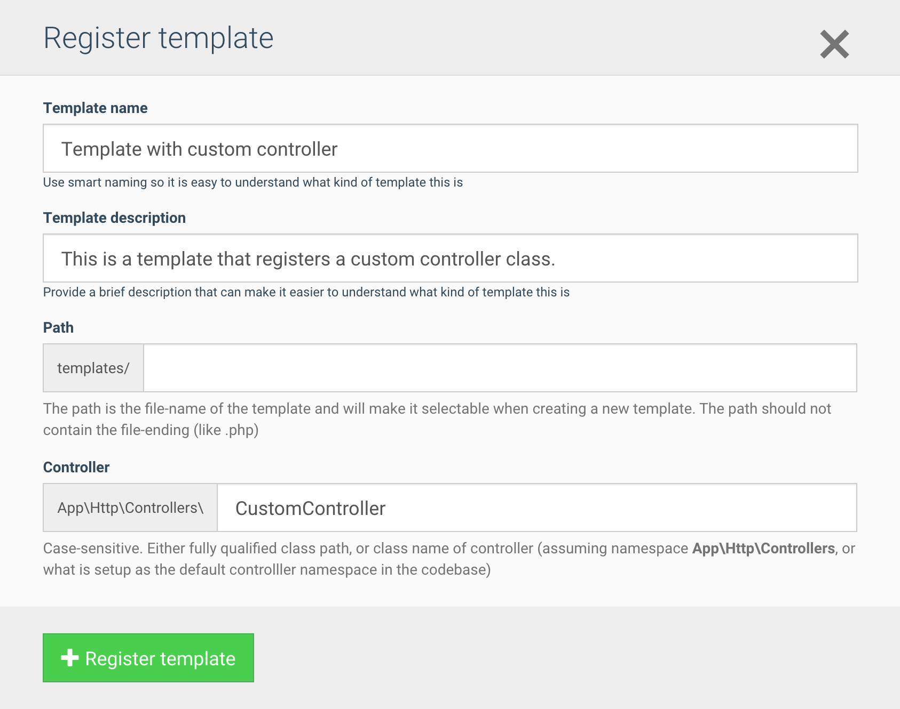

# Routing

The Netflex SDK extends [Laravel's built-in routing](https://laravel.com/docs/7.x/routing) with some additional features unique for Netflex.

Routes are configured provided by your applications RouteServiceProvider class, located in [`app/Providers/RouteServiceProvider.php`](https://github.com/NetflexSites/sdk-template-standard/blob/dev/app/Providers/RouteServiceProvider.php).

This file determines how routes should be defined in Laravels router. As you can see, in the default Netflex SDK template, instead of inheriting from Laravels RouteServiceProvider, we extend from the the [`Netflex\Pages\Providers\RouteServiceProvider`](https://github.com/netflex-sdk/pages/blob/master/src/Providers/RouteServiceProvider.php) class.

The RouteServiceProvider is responsible for registering routes in your application. The Netflex provided route service provider works just like Laravels, but it will also automatically register routes for [Pages](https://github.com/netflex-sdk/pages) and [Redirects](https://github.com/netflex-sdk/foundation) defined in Netflexapp.

## API reference

The full technical API reference for the Netflex\Pages namespace can be [found here](https://netflex-sdk.github.io/docs/api/Netflex/Pages.html).

## Registering a route through Netflex

When you create a Page in Netflexapp, its route will automatically be registered in your application (respecting publishing status). For simple pages that only require a simple template to render, you don't need to do anything, it should just work. If a template exists for the given page, it will be rendered.

## Advanced routing through Netflex

Most often, you will probably need to route a Page through a custom controller to handle logic, and binding data to your view. Maybe you also need to handle more than just a simple GET request, or you need to extract parameters from the URL.

In this case, you will have to register a custom controller to handle your Page. This is done through Netflexapp.

> [!WARNING]
> Ensure that the custom controller actually exists in your project. Otherwise, you will get an exception when Netflex SDK is registering the route. In the production environment, it will just be silently discarded to prevent the site from not working.



### Creating the custom controller

The custom controller **MUST** inherit from the `Netflex\Pages\Controllers\Controller`. The default `App\Http\Controllers\Controller` class does inherit from this class, so it is recommended that you always extends that class. If you extends Laravel's default controller, it will not work.

A custom controller can define a number of sub-routes. Those routes will also be automatically be registered. This can be usefull when you have a template that should both list a resource, and also be able to display one specific resource, e.g. a Model.

> [!NOTE]
> To be able to use the inline editing and preview features of Netflexapp, your controller **MUST** provide a index route (/)

If you want to override the default 'index' route for a controller, you **MUST** override the route in the controller configuration.

```php
<?php

namespace App\Http\Controllers;

class CustomController extends Controller
{
  protected $routes = [
    [
      'methods' => ['GET'],
      'url' => '/',
      'action' => 'index'
    ]
  ];

  public function index()
  {
    return 'Hello from the index route';
  }
}
```

The `methods` array defines which HTTP methods the route should listen for. The `url` string defines what URL pattern the route should match (using the same syntax as regular Laravel routes, including paremter binding). The `action` string defined the method name on the controller that should be executed when the router matches this route.

> [!NOTE]
> Note that the routes defined in a custom controller are relative from their associated Page. If the Page has a URL of `/articles` and the controllers registers a route with a URL like `/{articleSlug}`, the composed route will be `/articles/{articleSlug}`.

You  can use dependency injection in your custom controller methods just like in regular Laravel routes.
